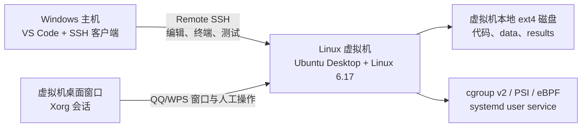

# Windows + VS Code + Linux 6.17 虚拟机完整操作手册

## 1. 推荐架构

本项目推荐使用以下结构：



核心原则：

1. VS Code 安装在 Windows，代码和 Python 环境放在 Linux 虚拟机本地磁盘。
2. VS Code 通过 Remote SSH 连接虚拟机，不使用 Windows 共享目录运行实验。
3. QQ/WPS 必须显示在虚拟机自己的桌面中。Remote SSH 只负责发命令，不负责显示 GUI。
4. 第一轮使用 Xorg，因为当前启动探针依赖 `wmctrl`。Wayland 下不能把 mapped-window 当成首帧。
5. 虚拟机适合功能验证和方案对比；正式发表级 I/O、FPS、功耗数据优先使用裸机。

VS Code 官方说明 Remote SSH 会在远端安装 VS Code Server，并让终端、调试器和多数扩展直接运行在远端系统：[VS Code Remote SSH 官方文档](https://code.visualstudio.com/docs/remote/ssh)。

## 2. 虚拟化平台选择

任选一种即可：

- VMware Workstation：桌面 Linux 兼容性通常较好，适合需要 QQ/WPS GUI 的场景。
- VirtualBox：免费且配置直观，建议使用“NAT + Host-only”双网卡。
- Hyper-V：适合 Windows Pro/Enterprise，但桌面显示、动态内存和虚拟交换机配置更容易影响性能实验。

本手册不依赖某个厂商。以下配置在三者中含义相同。

### 2.1 推荐虚拟机规格

| 项目 | 建议 |
|---|---|
| Guest OS | Ubuntu Desktop 24.04 LTS x86_64 |
| 固件 | UEFI；首次自编译内核建议关闭虚拟机 Secure Boot |
| vCPU | 固定 4 vCPU，不动态调整 |
| 内存 | Acclaim/Fleet 4 GiB；AppFlow 8 GiB；关机后再切换 |
| 系统盘 | 100 GiB，动态扩容可用，但实验期间不要扩容或做快照 |
| 文件系统 | 虚拟机本地 ext4 |
| 显示 | 开启 3D 加速仅用于 QQ/WPS/FPS 冒烟；设置一经确定不要改变 |
| 网络 | 一张 NAT 网卡上网；可增加一张 Host-only 网卡专用于 SSH |

内核源码和构建产物通常需要约 12 GiB 空间，`/boot` 也需要预留空间；这是 Linux 内核官方快速构建指南给出的量级。[Linux 内核官方构建指南](https://docs.kernel.org/admin-guide/quickly-build-trimmed-linux.html)

### 2.2 为什么需要两种内存规格

- Acclaim/Fleet 场景按 4 GiB 上限运行。
- AppFlow 高压场景包含 15 个小 worker、2 个 1 GiB worker 和 1.2 GiB 目标数据，建议 8 GiB。
- 项目中的内存 guard 会读取主机 `MemTotal` 和当前 cgroup v2 各级 `memory.max`，超出场景上限会拒绝正式运行。

若只做功能冒烟，可设置 `ALLOW_UNCONSTRAINED_MEMORY=1`，但此结果不能标成论文对齐数据。

## 3. 创建与安装虚拟机

1. 从 Ubuntu 官方站点下载 Ubuntu Desktop 24.04 LTS ISO。
2. 新建虚拟机，按上表分配 CPU、内存和磁盘。
3. 关闭 Secure Boot，或准备完整的自签名内核流程。初次实验建议关闭。
4. 安装 Ubuntu 时创建普通用户，例如 `memexp`，不要日常直接使用 root。
5. 安装完成后更新基础系统：

```bash
sudo apt update
sudo apt full-upgrade -y
sudo reboot
```

6. 在虚拟机管理器中创建第一个快照：`01-clean-ubuntu`。

不要在实验采集中执行快照、挂起、动态扩容、在线迁移或调整 vCPU/内存。

## 4. 配置虚拟机网络和 SSH

### 4.1 网络模式

推荐双网卡：

- 网卡 1：NAT，用于 `apt`、VS Code Server 和软件包下载。
- 网卡 2：Host-only，仅供 Windows 主机访问 SSH。

如果只使用一张网卡：

- Bridged：虚拟机直接出现在局域网，连接方便，但需要防火墙保护。
- NAT：VMware/Hyper-V 通常允许主机访问 Guest IP；VirtualBox 默认 NAT 通常需要端口转发，例如主机 `127.0.0.1:2222` 到 Guest `22`。

在 Linux 中查看地址：

```bash
ip -br address
hostname -I
ip route
```

### 4.2 安装 SSH Server

在虚拟机终端中执行：

```bash
sudo apt install -y openssh-server
sudo systemctl enable --now ssh
systemctl status ssh --no-pager
ss -lntp | grep ':22'
```

如果启用了 UFW：

```bash
sudo ufw allow OpenSSH
sudo ufw status
```

Ubuntu 的 OpenSSH Server 配置说明见：[Ubuntu OpenSSH 官方文档](https://ubuntu.com/server/docs/service-openssh/)。

### 4.3 Windows 创建 SSH 密钥

在 Windows PowerShell 执行：

```powershell
New-Item -ItemType Directory -Force "$env:USERPROFILE\.ssh"
ssh-keygen -t ed25519 -f "$env:USERPROFILE\.ssh\id_ed25519_linux617" -C "linux617-vm"
```

先用密码把公钥复制到虚拟机。将 IP 和用户名替换成实际值：

```powershell
Get-Content "$env:USERPROFILE\.ssh\id_ed25519_linux617.pub" |
  ssh memexp@192.168.56.101 "umask 077; mkdir -p ~/.ssh; cat >> ~/.ssh/authorized_keys"
```

验证无密码登录：

```powershell
ssh -i "$env:USERPROFILE\.ssh\id_ed25519_linux617" memexp@192.168.56.101
```

### 4.4 Windows SSH 配置

编辑 `C:\Users\15003\.ssh\config`：

```sshconfig
Host linux617-vm
    HostName 192.168.56.101
    User memexp
    IdentityFile C:/Users/15003/.ssh/id_ed25519_linux617
    IdentitiesOnly yes
    ServerAliveInterval 30
    ServerAliveCountMax 4
```

验证：

```powershell
ssh linux617-vm
```

必须先保证普通 PowerShell 的 `ssh linux617-vm` 成功，再处理 VS Code。

## 5. 安装 Linux 6.17 内核

Ubuntu 24.04 自带内核不一定是 6.17。本项目的 `preflight.sh` 会要求 `uname -r` 以 `6.17` 开头。

### 5.1 安装构建依赖

```bash
sudo apt install -y \
  bc binutils bison build-essential dwarves fakeroot flex git libelf-dev \
  libncurses-dev libssl-dev pahole perl-base pkg-config rsync zstd
```

Linux 内核官方指南列出的核心依赖包括 `bc`、`binutils`、`bison`、`flex`、`gcc`、`git`、`openssl`、`pahole`、Perl、libelf 和 OpenSSL 开发头文件。[官方构建依赖说明](https://docs.kernel.org/admin-guide/quickly-build-trimmed-linux.html#install-build-requirements)

### 5.2 下载并检出 v6.17

```bash
mkdir -p ~/src
cd ~/src
git clone --depth 1 --branch v6.17 \
  https://git.kernel.org/pub/scm/linux/kernel/git/torvalds/linux.git linux-6.17
cd linux-6.17
git describe --tags --always
```

如果该浅克隆方式因服务器策略失败，可从 [kernel.org](https://www.kernel.org/) 下载 `linux-6.17.tar.xz`，校验后解压。

### 5.3 以 Ubuntu 当前配置为基础

```bash
cd ~/src/linux-6.17
cp "/boot/config-$(uname -r)" .config
make olddefconfig
```

确保实验所需功能开启：

```bash
scripts/config --enable BPF
scripts/config --enable BPF_SYSCALL
scripts/config --enable BPF_JIT
scripts/config --enable BPF_EVENTS
scripts/config --enable DEBUG_INFO_BTF
scripts/config --enable FTRACE
scripts/config --enable TRACING
scripts/config --enable TRACEPOINTS
scripts/config --enable CGROUPS
scripts/config --enable CGROUP_BPF
scripts/config --enable MEMCG
scripts/config --enable CGROUP_SCHED
scripts/config --enable BLK_CGROUP
scripts/config --enable PSI
scripts/config --enable SWAP
scripts/config --set-str SYSTEM_TRUSTED_KEYS ""
scripts/config --set-str SYSTEM_REVOCATION_KEYS ""
make olddefconfig
```

检查关键配置：

```bash
grep -E 'CONFIG_(BPF|BPF_SYSCALL|BPF_JIT|BPF_EVENTS|DEBUG_INFO_BTF|FTRACE|TRACING|CGROUPS|MEMCG|BLK_CGROUP|PSI|SWAP)=' .config
```

### 5.4 编译和安装

编译前创建虚拟机快照 `02-before-kernel-install`。

```bash
cd ~/src/linux-6.17
make -j"$(nproc)"
kernel_release="$(make -s kernelrelease)"
sudo make modules_install
sudo make install
sudo update-initramfs -c -k "$kernel_release" || true
sudo update-grub
```

查看 GRUB 是否生成 6.17 项：

```bash
grep -R "menuentry .*6.17" /boot/grub/grub.cfg
ls -lh /boot/vmlinuz-* /boot/initrd.img-*
```

重启：

```bash
sudo reboot
```

回来后验证：

```bash
uname -a
test "$(uname -r | cut -d. -f1,2)" = "6.17"
zgrep -E 'CONFIG_(BPF|BPF_SYSCALL|DEBUG_INFO_BTF|MEMCG|PSI)=' /proc/config.gz 2>/dev/null || \
  grep -E 'CONFIG_(BPF|BPF_SYSCALL|DEBUG_INFO_BTF|MEMCG|PSI)=' "/boot/config-$(uname -r)"
```

确认成功后创建快照 `03-linux-6.17-bootable`。

### 5.5 无法启动时恢复

1. 在 GRUB 中选择 `Advanced options for Ubuntu`。
2. 启动原 Ubuntu 内核，不要删除原内核。
3. 修复 6.17 配置或恢复 `02-before-kernel-install` 快照。
4. 不要在确认新内核稳定前删除旧内核和旧 initramfs。

## 6. 把项目放到 Linux 本地磁盘

项目当前在 Windows：

```text
C:\Users\15003\Documents\linux6.17_test
```

不要直接在 VMware Shared Folder、VirtualBox Shared Folder 或 SMB 目录中采集 I/O 数据。把项目复制到 Guest 的 ext4 文件系统。

由于当前仓库文件尚未提交，第一次建议打包传输。在 Windows PowerShell 中执行：

```powershell
Set-Location "C:\Users\15003\Documents\linux6.17_test"
tar -czf "$env:TEMP\linux6.17_test.tar.gz" `
  --exclude=.git --exclude=.venv --exclude=tmp --exclude=data --exclude=results .
scp "$env:TEMP\linux6.17_test.tar.gz" linux617-vm:~/
ssh linux617-vm "mkdir -p ~/workspace/linux6.17_test && tar -xzf ~/linux6.17_test.tar.gz -C ~/workspace/linux6.17_test"
```

在虚拟机中初始化环境：

```bash
cd ~/workspace/linux6.17_test
python3 -m venv .venv
source .venv/bin/activate
python -m pip install --upgrade pip
python -m pip install -e .
python -m unittest discover -s tests -v
```

以后推荐用 Git 在 Windows 和 Linux 之间同步代码，不要反复覆盖整个目录。`data/`、`results/`、`.env.vm.local` 和 `.venv/` 不进入 Git。

## 7. 配置 VS Code Remote SSH

### 7.1 Windows 端安装

1. 安装最新稳定版 Visual Studio Code。
2. 安装扩展 `Remote - SSH`，扩展 ID 为 `ms-vscode-remote.remote-ssh`。
3. 按 `Ctrl+Shift+P`，运行 `Remote-SSH: Connect to Host...`。
4. 选择 `linux617-vm`，远端平台选择 Linux。
5. 连接后选择 `File -> Open Folder`，打开：

```text
/home/memexp/workspace/linux6.17_test
```

VS Code 官方建议先在普通终端确认 SSH 可用，然后再从命令面板连接；首次连接会在远端安装 VS Code Server。[官方连接步骤](https://code.visualstudio.com/docs/remote/ssh#_connect-to-a-remote-host)

### 7.2 安装远端扩展

打开项目后，VS Code 会读取 [.vscode/extensions.json](../.vscode/extensions.json)，推荐：

- Python
- Pylance
- ShellCheck
- Remote SSH

Python、Pylance 和 ShellCheck 应显示为“Installed in SSH: linux617-vm”。不要只安装在 Windows Local 一侧。

### 7.3 选择 Python 解释器

按 `Ctrl+Shift+P`，运行 `Python: Select Interpreter`，选择：

```text
/home/memexp/workspace/linux6.17_test/.venv/bin/python
```

项目 [.vscode/settings.json](../.vscode/settings.json) 已将默认解释器配置为 `${workspaceFolder}/.venv/bin/python`。

验证 VS Code 终端确实运行在虚拟机：

```bash
hostname
uname -r
pwd
which python
python -c 'import memsched_exp; print(memsched_exp.__file__)'
```

期望：`uname -r` 是 6.17，`pwd` 是 `/home/...`，Python 来自 `.venv/bin`。

## 8. 连接 Remote SSH 与虚拟机 GUI 会话

这是最关键、也最容易出错的一步。

SSH 终端默认没有图形桌面的 `DISPLAY`、X11 authority 和用户 DBus 环境。因此直接在 VS Code 终端运行 QQ/WPS，常见结果是：

- `wmctrl: Cannot open display`
- `systemctl --user: Failed to connect to bus`
- QQ/WPS 进程启动但窗口不出现
- 启动延迟一直超时

### 8.1 登录 Xorg 桌面

1. 打开虚拟机窗口。
2. 在 Ubuntu 登录界面选择用户。
3. 点击齿轮，选择 `Ubuntu on Xorg`。
4. 登录桌面，保持该桌面会话处于活动状态。

验证：

```bash
echo "$XDG_SESSION_TYPE"
```

应输出 `x11`。

### 8.2 从 GUI 终端捕获环境

必须在虚拟机桌面里打开 Terminal，然后执行：

```bash
sudo apt install -y wmctrl
cd ~/workspace/linux6.17_test
bash scripts/capture_gui_session_env.sh
```

它会创建权限受限且被 Git 忽略的 `.env.vm.local`，保存：

- `DISPLAY`
- `XAUTHORITY`
- `XDG_RUNTIME_DIR`
- `DBUS_SESSION_BUS_ADDRESS`
- `XDG_SESSION_TYPE`

不要手工复制示例文件，除非确认 UID、DISPLAY 和 Xauthority 路径完全正确。

### 8.3 从 VS Code 验证 GUI 连接

回到 Remote SSH 窗口的终端：

```bash
cd ~/workspace/linux6.17_test
bash scripts/with_gui_session.sh wmctrl -m
bash scripts/with_gui_session.sh systemctl --user status --no-pager
```

`wmctrl -m` 应打印 GNOME/Mutter 窗口管理器信息。若失败，重新登录虚拟机桌面并再次捕获环境。

每次以下情况发生后都需要重新执行 `capture_gui_session_env.sh`：

- 虚拟机重启
- 用户注销再登录
- 从 Xorg 切换到 Wayland
- DISPLAY 或 Xauthority 路径变化
- 恢复较旧的虚拟机快照

## 9. 安装实验工具、QQ 和 WPS

在 VS Code Remote SSH 终端中：

```bash
cd ~/workspace/linux6.17_test
source .venv/bin/activate
bash scripts/install_qq_wps_ubuntu.sh
```

脚本会安装 bpftrace、bpftool、clang/LLVM、fio、stress-ng、wmctrl、xdotool 等依赖，并只从 QQ/WPS 官方下载页寻找安装包。

安装后必须在虚拟机桌面中分别启动 QQ 和 WPS：

1. 完成 QQ 登录和初始化。
2. 完成 WPS 首次启动、许可和字体提示。
3. 关闭自动升级弹窗、云文档提示和无关插件。
4. 准备固定的本地 QQ 会话和 WPS 测试文档。
5. 正常退出两个应用，再开始实验。

创建快照 `04-tools-apps-ready`。快照中是否保留账号登录状态需按数据安全要求决定。

## 10. 使用 VS Code Tasks 操作实验

按 `Ctrl+Shift+P`，运行 `Tasks: Run Task`。项目已经提供：

- `Test: Python unit tests`
- `Linux: Preflight`
- `Experiment: QQ + WPS first cold round`
- `Experiment: Acclaim 8 background apps`
- `Experiment: AppFlow medium`
- `Experiment: Fleet 512-byte objects`
- `Report: Build summary.csv`

配置位于 [.vscode/tasks.json](../.vscode/tasks.json)。QQ/WPS 和 preflight 任务会自动通过 `with_gui_session.sh` 加载图形环境。

需要输入 sudo 密码时，在 VS Code 的任务终端中输入。不要将 sudo 密码写进脚本或配置文件。

## 11. 第一次 QQ/WPS 采集的标准流程

### 11.1 实验前检查

虚拟机管理器中确认：

- RAM 和 vCPU 数量正确且固定
- 没有运行快照、备份、磁盘整理
- Windows 主机没有高负载任务
- 虚拟机桌面为 Xorg 且未锁屏
- QQ/WPS 登录状态和测试内容固定

在 VS Code 终端执行：

```bash
cd ~/workspace/linux6.17_test
source .venv/bin/activate
uname -r
bash scripts/with_gui_session.sh bash scripts/preflight.sh
python -m unittest discover -s tests -v
```

所有 `FAIL` 必须先解决。`bpftrace` 缺失时可以采集 vmstat fallback，但不能报告精确 direct-reclaim 事件数。

### 11.2 普通进程冷启动首轮

```bash
COLD_REPETITIONS=1 DROP_CACHES=0 \
  bash scripts/with_gui_session.sh bash scripts/run_qq_wps_round.sh
```

脚本将依次：

1. 停止上一轮目标应用并确认进程清理。
2. 启动系统采集器和 eBPF。
3. 等待 eBPF `collector_start`。
4. 创建应用 systemd user service 和独立 cgroup。
5. 写入单调时钟启动标记。
6. 只接受新出现且 PID 属于该 cgroup 的 X11 窗口。
7. 同步采集 60 秒。
8. 停止应用和 service，再进入下一个应用。

终端提示交互时，在虚拟机桌面中执行固定动作。不要在 VS Code 中最小化或关闭虚拟机窗口。

### 11.3 严格冷缓存

仅在隔离实验虚拟机使用：

```bash
COLD_REPETITIONS=1 DROP_CACHES=1 \
  bash scripts/with_gui_session.sh bash scripts/run_qq_wps_round.sh
```

这会执行 Guest 内的 `sync` 和 `/proc/sys/vm/drop_caches`。它不会清除宿主机对虚拟磁盘的缓存，因此虚拟机严格冷缓存仍不等价于物理设备冷启动。

### 11.4 生成和检查报告

```bash
python -m memsched_exp.report \
  --root results \
  --output results/summary.csv
```

快速检查最近一轮：

```bash
latest="$(find results -maxdepth 1 -type d -name 'qq-wps-*' | sort | tail -n 1)"
find "$latest" -maxdepth 3 -type f | sort
jq '{timed_out, launch_latency_ms, measurement_source, window}' "$latest"/*/launch.json
jq '{valid, invalid_reasons, direct_reclaim_count, parse_errors, lost_events_detected}' \
  "$latest"/*/reclaim-events-summary.json
jq '.cgroup | {valid, invalid_reasons, page_refault_count, io_read_throughput_mb_s}' \
  "$latest"/*/cgroup/summary.json
```

只有 `measurement_valid=true`、launch 未超时、cgroup valid、eBPF valid 的轮次才能进入正式统计。

## 12. 运行论文工作负载

### 12.1 Acclaim

关机后把虚拟机内存设为 4 GiB：

```bash
sudo poweroff
```

重新开机后：

```bash
cd ~/workspace/linux6.17_test
source .venv/bin/activate
bash scripts/scenarios/run_acclaim.sh 0
bash scripts/scenarios/run_acclaim.sh 3
bash scripts/scenarios/run_acclaim.sh 8
bash scripts/scenarios/run_acclaim.sh 15
```

默认前台 worker 与采集器使用同一个 `DURATION_SECONDS`。前台进入独立 cgroup，能够汇总 foreground refault。

### 12.2 AppFlow

关机，把虚拟机内存设为 8 GiB，再启动：

```bash
bash scripts/scenarios/run_appflow.sh low
bash scripts/scenarios/run_appflow.sh medium
bash scripts/scenarios/run_appflow.sh high
```

第一次会完整写入并 `fsync` 1.2 GiB 伪随机文件，同时保存 SHA-256 manifest。确保 Guest 磁盘至少有 3 GiB 可用空间。

严格冷缓存：

```bash
DROP_CACHES=1 bash scripts/scenarios/run_appflow.sh high
```

### 12.3 Fleet

关机，把虚拟机内存设为 4 GiB，再启动：

```bash
bash scripts/scenarios/run_fleet.sh 512 18
bash scripts/scenarios/run_fleet.sh 2048 18
```

JVM 在热阶段结束后继续驻留，不会在 30 秒时自然退出。runner 遇到新 app 未 ready 或存活数下降时停止继续加压。

## 13. 从 Windows 操控虚拟机

优先使用虚拟机管理器 GUI。命令行模板如下，名称和路径需要替换。

### 13.1 VirtualBox

```powershell
VBoxManage startvm "Linux617" --type gui
VBoxManage controlvm "Linux617" acpipowerbutton
VBoxManage snapshot "Linux617" take "04-tools-apps-ready"
VBoxManage list runningvms
```

### 13.2 VMware Workstation

```powershell
vmrun start "D:\VMs\Linux617\Linux617.vmx" gui
vmrun stop "D:\VMs\Linux617\Linux617.vmx" soft
vmrun snapshot "D:\VMs\Linux617\Linux617.vmx" "04-tools-apps-ready"
```

### 13.3 Hyper-V（管理员 PowerShell）

```powershell
Start-VM -Name "Linux617"
Stop-VM -Name "Linux617" -Shutdown
Checkpoint-VM -Name "Linux617" -SnapshotName "04-tools-apps-ready"
Get-VM -Name "Linux617"
```

停止虚拟机优先使用 Guest 内 `sudo poweroff` 或 ACPI soft shutdown。不要使用强制断电，除非系统已经失去响应。

恢复快照会覆盖快照后的 Guest 状态。恢复前先把 `results/` 导出到 Windows或其他存储，并断开 VS Code Remote SSH。

## 14. 端口 7892 代理配置（可选）

虚拟机里的 `127.0.0.1` 指向虚拟机自己，不是 Windows 主机。因此 Windows 代理监听 `127.0.0.1:7892` 时，Guest 不能直接使用。

先确认你的代理端口类型：HTTP、SOCKS5 或 mixed。你使用的不是 Clash，所以不要照抄 Clash 专用配置。

可行方法：

1. 在代理软件中允许来自 Host-only 网段的 LAN 连接。
2. 在 Windows `ipconfig` 中找到 Host-only 网卡地址，例如 `192.168.56.1`。
3. Windows 防火墙只允许 Host-only 网段访问 TCP 7892，不要开放到公共网络。
4. 在 Guest 临时设置。若端口是 HTTP/mixed：

```bash
export http_proxy=http://192.168.56.1:7892
export https_proxy=http://192.168.56.1:7892
curl -I https://code.visualstudio.com
```

若端口是 SOCKS5：

```bash
export ALL_PROXY=socks5h://192.168.56.1:7892
curl -I https://code.visualstudio.com
```

不要同时设置错误类型的 HTTP 和 SOCKS 地址。代理只用于安装阶段；正式联网对比实验中应固定是否使用代理并记录。

VS Code 官方指出，Remote SSH 不会自动复用本机代理；远端扩展需要远端代理变量。不过 VS Code Server 默认可在远端下载失败后改为本地下载并通过 SSH 传输。[Remote SSH 网络要求](https://code.visualstudio.com/docs/remote/ssh#_what-are-the-connectivity-requirements-for-the-vs-code-server-when-it-is-running-on-a-remote-machine-vm)

## 15. 常见故障

### 15.1 VS Code 连不上 SSH

按顺序检查：

```powershell
ping 192.168.56.101
ssh -vvv linux617-vm
```

Guest 中检查：

```bash
ip -br address
systemctl status ssh --no-pager
sudo journalctl -u ssh -n 100 --no-pager
sudo ufw status
```

### 15.2 Remote SSH 卡在安装 VS Code Server

1. 打开 VS Code `Output -> Remote - SSH` 查看日志。
2. 确认 Guest 可访问 HTTPS 443，或配置 7892 代理。
3. VS Code 设置中把 `Remote.SSH: Local Server Download` 设为 `always`，让 Windows 下载后通过 SSH 传入。
4. 确认 Guest 有 `bash`、`tar`、`curl` 或 `wget`；这些是官方列出的远端基础要求。

### 15.3 `wmctrl: Cannot open display`

```bash
echo "$XDG_SESSION_TYPE"
bash scripts/capture_gui_session_env.sh   # 必须在 Guest GUI Terminal 中
bash scripts/with_gui_session.sh wmctrl -m
```

如果桌面是 Wayland，注销并在登录界面选择 `Ubuntu on Xorg`。

### 15.4 `systemctl --user` 无法连接 bus

```bash
cat .env.vm.local
ls -l "/run/user/$(id -u)/bus"
bash scripts/with_gui_session.sh systemctl --user status --no-pager
```

不要用 root 运行 QQ/WPS，也不要把 root 的 DBus 环境和普通用户混用。

### 15.5 bpftrace 无法附着

```bash
sudo -v
sudo bpftrace -l 'tracepoint:vmscan:mm_vmscan_direct_reclaim_*'
sudo bpftrace -l 'tracepoint:oom:mark_victim'
mount | grep tracefs
ls /sys/kernel/tracing/events/vmscan
```

再次运行：

```bash
bash scripts/preflight.sh
```

如果 tracepoint 缺失，不能把 vmstat fallback 冒充精确事件次数。

### 15.6 内存场景被 guard 拒绝

查看：

```bash
cat results/*/memory-pressure-baseline.json | jq .
cat /sys/fs/cgroup/memory.max
free -h
```

关机后调整虚拟机 RAM，或让整个场景运行在具有正确 `memory.max` 的上层 cgroup。不要为了正式结果直接设置 `ALLOW_UNCONSTRAINED_MEMORY=1`。

### 15.7 启动时间异常接近 0 ms

检查：

```bash
jq . results/qq-wps-*/*/launch.json
cat results/qq-wps-*/*/cgroup.path
```

当前实现会排除启动前已有窗口，并要求新窗口 PID 属于目标 cgroup。如果仍异常，保存 `wmctrl -lp`、`systemctl --user status UNIT` 和 launch JSON。

## 16. 虚拟机实验的有效性边界

以下指标在虚拟机中只能解释为“Guest + 虚拟化平台组合”的结果：

- 块设备 I/O 吞吐受宿主机页缓存、虚拟磁盘格式和宿主存储影响。
- FPS 受虚拟 GPU、远程桌面、窗口缩放和宿主显示负载影响。
- CPU 使用率受 vCPU 调度和宿主机 steal time 影响。
- 直接回收和 refault 在 Guest 内是真实内核行为，但触发时机仍受虚拟机 RAM 和 balloon 影响。
- 功耗、温度和手机 LMKD/ART 指标不能用桌面虚拟机替代。

因此建议：

1. 虚拟机用于验证采集链、回归测试和策略趋势。
2. 正式 I/O/FPS 数据使用固定裸机或设备直通。
3. baseline 和 candidate 使用同一虚拟机快照、同一宿主机、相同 VM 配置并交错运行。
4. 实验期间关闭宿主机大型下载、杀毒全盘扫描、备份、其他虚拟机和动态内存。

## 17. 每次实验检查表

### 启动前

- [ ] 虚拟机从正确快照启动，没有恢复未导出的旧快照
- [ ] `uname -r` 为 6.17.x
- [ ] vCPU、RAM、虚拟磁盘和显示配置正确
- [ ] Ubuntu Xorg 桌面已登录且未锁屏
- [ ] `.env.vm.local` 已重新捕获
- [ ] VS Code 左下角显示 `SSH: linux617-vm`
- [ ] Python 解释器为 `.venv/bin/python`
- [ ] `preflight.sh` 无 FAIL
- [ ] Python 单元测试全部通过
- [ ] QQ/WPS 登录状态和测试内容固定
- [ ] Windows 宿主机空闲

### 运行中

- [ ] 不操作虚拟机管理器配置
- [ ] 不做快照、不挂起、不锁屏
- [ ] 按固定脚本操作 QQ/WPS
- [ ] 不运行额外应用或下载
- [ ] 记录任何弹窗、升级、网络变化或人为偏差

### 运行后

- [ ] launch 未 timeout
- [ ] cgroup `valid=true`
- [ ] eBPF `valid=true` 或明确标注 fallback
- [ ] `measurement_valid=true`
- [ ] 生成 `summary.csv`
- [ ] 把 `results/` 备份到虚拟机外
- [ ] 不删除 raw JSON/JSONL
